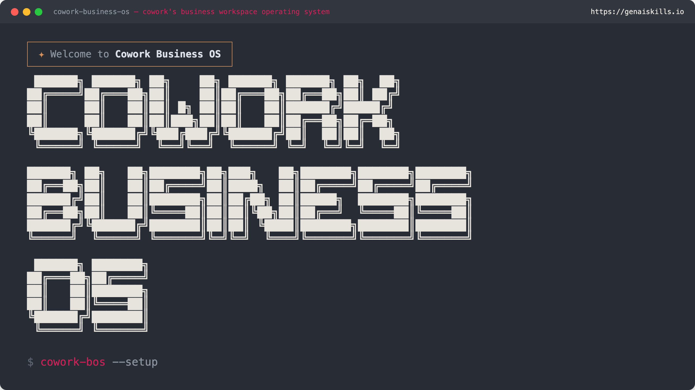

<p align="center">
  
</p>

# Cowork Business OS

**Version:** v2.1.0

A working operating system for running your business inside Cowork (the Claude desktop app's knowledge-work mode).

Four plugins that work together to turn Cowork into a complete business OS: core content skills plus a workspace scaffolder, project and session lifecycle, searchable session history, and academic research with citation management.

## Relationship to AI Business OS

Cowork Business OS is a derivative of **AI Business OS**, the original and fuller product built for Claude Code in VS Code. AI Business OS is where the engine, the skills, the rules, and the PRIMA project management system were all developed first. Cowork Business OS is the adapted version — the parts that fit inside Cowork's plugin model, packaged as four plugins you can install into the Claude desktop app.

The two are for different users.

**AI Business OS (Claude Code in VS Code) is the more powerful option.** It's designed for people comfortable with a developer-style environment — VS Code, Git, a repository, the command line when needed. Because it runs inside a real workspace on your machine, it has capabilities that Cowork's plugin sandbox cannot provide:

- **Hooks** — automatic behaviours that fire before or after tool calls (e.g. auto-checkpoint every 20 tool calls, block destructive commands, validate state writes). Cowork plugins cannot run hooks.
- **MCP servers beyond what Cowork allows** — richer integrations (CRM, custom databases, external APIs) that Cowork's plugin surface currently restricts.
- **Fuller rule layer** — dozens of behavioural rules auto-loaded from `.claude/rules/` covering communication standards, file organisation, state validation, commit discipline, research standards, parallel agent coordination, and more. Cowork plugins carry a lighter slice of these.
- **Per-machine state persistence and Git sync** — your workspace is a real repository, so history, rollback, branches, and multi-device sync work natively.
- **Extension packs** — additional skill bundles for specific industries or functions (accountancy, coaching, property management, education, etc.).
- **`/update` workflow** — engine updates delivered without losing customisations, via a three-tier manifest that separates engine files from your files.
- **Managed-install option** — for non-technical users, Larry installs and maintains AI Business OS on their repository; updates arrive automatically.

**Cowork Business OS is the publicly available option.** It was designed specifically for Cowork — the Claude desktop app's knowledge-work mode — which is a more constrained environment by design. It gives you the core of what AI Business OS offers (scaffolding, content skills, project tracking, session memory, academic research) without the developer tooling. If you don't want to touch VS Code or Git and just want Claude to help you run your business inside the desktop app, this is the right choice, and you can install it yourself by following the steps below. It is free and MIT-licensed.

**AI Business OS is not publicly installable.** It is a client-only product. Larry installs, configures, and maintains AI Business OS for each client on their own private repository as part of an engagement. There is no public download and no self-service signup. A public preview repository at https://github.com/larrygmaguire-hash/ai-business-os-preview shows the structure, skills, commands, and documentation so you can see what it does before enquiring — but it is for inspection only, not installation. To get AI Business OS for your business, contact Larry directly (hello@humanperformance.ie) to discuss an install.

**When to pick which:**

| Your situation | The right option |
|---|---|
| Individual user, Free/Pro/Max plan, wants to install today without support | **Cowork Business OS** (this repo, free) |
| Wants to stay entirely inside the Claude desktop app | **Cowork Business OS** |
| No VS Code, no Git, no terminal | **Cowork Business OS** |
| Business/client who wants a fully managed install, updates handled, extension packs tailored to their industry | **AI Business OS** (client engagement) |
| Needs hooks, the full rule layer, richer MCP integrations, or a workspace as a real Git repository | **AI Business OS** (client engagement) |

Both products share the PRIMA project management system (state schema, commands, skills) — so the way of working is consistent across them. A business that starts on Cowork Business OS and later moves to an AI Business OS client install will find the project structure and workflows translate directly.

For AI Business OS enquiries: hello@humanperformance.ie.

## The plugins

| Plugin | What it does | Required? |
|---|---|---|
| `cowork-business-os` | Core. Scaffolds a business workspace (`.claude/`, `Projects/`, `Clients/`, numbered business folders, PRIMA state scripts) into a folder you pick. Ships 10 content-production skills. | Install first |
| `prima-project-management` | Daily project tracking — daily briefing, session close, save, resume, status, new project, new client, sync, timeline, dashboard. Three skills for project tracking, session transcripts, Zoom meetings. | Requires `cowork-business-os` |
| `prima-memory` | Searchable history of your past Cowork conversations. Bundled MCP server for semantic + keyword session recall. | Standalone |
| `prima-scholar` | Academic research across PubMed, arXiv, Semantic Scholar, CrossRef, bioRxiv, OpenAlex, Europe PMC, CORE. Local research library. APA7 citations. Bundled MCP servers. | Standalone |

## Repository structure

```
cowork-business-os/                          Marketplace root (this repo)
├── .claude-plugin/
│   └── marketplace.json                     Registry — what Cowork/Claude Code reads
├── .github/
│   └── workflows/
│       └── release.yml                      Builds the .plugin files on every version tag
├── assets/
│   └── brand-card.png                       Marketplace card image
│
├── cowork-business-os/                      Plugin 1 — core content skills + scaffolder
│   ├── .claude-plugin/plugin.json
│   ├── commands/
│   │   └── setup.md                         /cowork-business-os:setup wizard
│   ├── skills/                              10 content-production skills
│   └── templates/                           Files written into your workspace on setup
│
├── prima-project-management/                Plugin 2 — project tracking + session lifecycle
│   ├── .claude-plugin/plugin.json
│   ├── commands/                            10 commands (see "Commands" section)
│   ├── skills/                              3 skills — project tracking, transcripts, Zoom
│   ├── agents/
│   └── scripts/                             backup-state.sh, validate-state.sh
│
├── prima-memory/                            Plugin 3 — searchable session history (MCP)
│   ├── .claude-plugin/plugin.json
│   ├── .mcp.json                            Registers prima-memory-mcp from npm
│   └── skills/session-recall/
│
├── prima-scholar/                           Plugin 4 — academic search + citations (MCP)
│   ├── .claude-plugin/plugin.json
│   ├── .mcp.json                            Registers scholar-search + scholar-library MCPs
│   ├── commands/                            3 commands — cite, library, scholar
│   └── skills/                              4 skills — research, writing with citations, etc.
│
├── CHANGELOG.md
├── CONTRIBUTING.md
├── LICENSE                                  MIT
├── README.md                                This file
└── VERSION                                  2.1.0
```

## Before you install — what you need

- A computer running **macOS or Windows**.
- The **Claude desktop app** installed. Download from https://claude.ai/download if you don't have it yet.
- A Claude account on any plan — **Free, Pro, or Max** all work for individual installs.
- About **10 minutes** for the first install and setup.

You do **not** need:
- A GitHub account.
- Any coding knowledge.
- The command line or Terminal.
- VS Code.

Everything happens inside the Claude desktop app. The only time you visit GitHub is to download four small files.

## Installing — step by step (non-technical users)

This section tells you exactly what to click, in order. If you've never installed a plugin before, follow every step.

### Step 1 — Download the four plugin files from GitHub

1. Click this link: https://github.com/larrygmaguire-hash/cowork-business-os/releases/latest
2. Scroll down on that page until you see a section called **Assets**.
3. In the Assets list, click each of these four file names, one at a time. Each click downloads the file to your computer (usually to your Downloads folder):
   - `cowork-business-os.plugin`
   - `prima-project-management.plugin`
   - `prima-memory.plugin`
   - `prima-scholar.plugin`
4. When all four are downloaded, leave them in your Downloads folder. You'll use them in the next step.

**Troubleshooting:** if your browser renames a file to something like `cowork-business-os.plugin.zip`, rename it back to `cowork-business-os.plugin` (remove the `.zip`). The file is a zip internally, but Cowork expects the `.plugin` extension. If you're not sure how to rename a file, leave it as-is and try uploading — some setups accept the `.zip` name.

### Step 2 — Open Claude and switch to Cowork

1. Open the **Claude desktop app**.
2. At the top of the app window, you'll see two tabs: **Claude** and **Cowork**.
3. Click **Cowork**.

### Step 3 — Upload the plugin files into Cowork

You need to upload all four files. You'll repeat the same five clicks for each file.

1. In the Cowork left sidebar, click **Customize**.
2. Click **Browse plugins**.
3. Click **Upload a custom plugin file**.
4. A file picker opens. Navigate to your Downloads folder and select `cowork-business-os.plugin`.
5. Click **Open** (or **Choose** on Mac). Cowork uploads the file and confirms when it's done.
6. Repeat steps 2–5 for each of the other three files: `prima-project-management.plugin`, `prima-memory.plugin`, `prima-scholar.plugin`.

After all four are uploaded, you'll see them listed as installed plugins.

### Step 4 — Scaffold your workspace (first time only, 3 minutes)

"Scaffolding" means creating the folder structure on your computer where all your business work will live. You only do this once.

1. Still in the Cowork tab, create a new task (or open an existing one — it doesn't matter which).
2. In the message box, type a single forward slash `/`. A small menu pops up listing the commands you have available.
3. Scroll or search until you see `cowork-business-os:setup`. Click it.
4. Press **Enter** to run the command.

The setup wizard will ask you questions, one at a time. Answer each in plain English:
- Your company name.
- Your industry (just a short description — "coaching", "accountancy", "design studio", etc.).
- The folder on your computer where you want the workspace created. You can type a path or drag a folder from Finder/Explorer into the chat.
- A few other details about your business (team size, primary services, etc.).

When it finishes, you'll have a new folder on your computer with everything set up. From this point on, all your business work — projects, clients, content, state — lives in that folder.

### Step 5 — You're done

You don't need to do anything for the other three plugins. `prima-project-management`, `prima-memory`, and `prima-scholar` are ready to use immediately. They wake up when you ask Claude to do something that matches their skills (for example, "start my day" triggers the daily briefing, "find that conversation from last week about X" triggers session memory, "find me five papers on Y" triggers academic search).

### What to try first

Pick one of these and type it as a normal message in Cowork:
- **Start your day:** `/prima-project-management:day` (you'll also see this in the `/` picker)
- **Write something:** `write me a LinkedIn post about the difference between skills and habits`
- **Search your history:** `what did I work on last Tuesday?` (works after you've had a few sessions)
- **Research a topic:** `find me recent papers on social loafing in remote teams`

## Commands (what you can trigger directly)

Cowork doesn't work the way Claude Code does. You don't usually type commands — you ask Claude to do things in plain English and skills fire automatically. But some operations are explicit commands, and you can run them two ways:

- **In Cowork:** type `/` in the message box to open the command picker, then click the command you want. Commands appear in the picker with their plugin namespace, like `prima-project-management:day`.
- **In Claude Code (developers only):** type the command directly, like `/day`.

Commands available across all four plugins:

| Plugin | Command | What it does |
|---|---|---|
| `cowork-business-os` | `setup` | First-time workspace wizard. Creates folders, CLAUDE.md, state files. |
| `prima-project-management` | `day` | Morning briefing — active projects, priorities, recommended next steps. |
| `prima-project-management` | `night` | End of session — summarise work, commit, push. |
| `prima-project-management` | `save` | Mid-session save — capture state so you can resume later. |
| `prima-project-management` | `resume` | Pick up exactly where you left off. |
| `prima-project-management` | `status` | Traffic-light health report across every project. |
| `prima-project-management` | `sync` | Quick commit and push. |
| `prima-project-management` | `newproject` | Create a new project folder with standardised structure. |
| `prima-project-management` | `newclient` | Create a new client folder with profile and templates. |
| `prima-project-management` | `timeline` | Interactive Gantt-style project timeline. |
| `prima-project-management` | `dashboard` | Visual project dashboard in your browser. |
| `prima-scholar` | `scholar` | Start a research session — search databases, save findings. |
| `prima-scholar` | `cite` | Look up a paper by DOI or title, return APA7 citation. |
| `prima-scholar` | `library` | Manage your research library — import, search, browse, stats. |

**`prima-memory` has no commands.** It's always listening in the background through its MCP server. Just ask: "what did we discuss last Tuesday?", "find the conversation where we decided X", "search my history for Y". The session recall skill picks it up automatically.

## Skills (what fires on natural language)

Skills run automatically when what you ask Claude matches the skill's trigger. You don't need to invoke them explicitly.

**`cowork-business-os` — 10 content-production skills**

| Skill | Fires when you ask for... |
|---|---|
| `copywriting` | Articles, blog posts, social media posts, landing pages, sales copy, ad copy, headlines, email sequences. |
| `seo-writing` | On-page SEO (Yoast-aligned), technical SEO audits, schema markup, keyword optimisation. |
| `email-drafting` | Client responses, introductions, follow-ups, meeting requests, internal comms. |
| `processing-documents` | Create or edit Word documents (.docx), tracked changes, comments, format conversion. |
| `processing-spreadsheets` | Create, edit, or analyse Excel/CSV files, add formulas, build financial models. |
| `processing-presentations` | Create PowerPoint decks from briefs, extract text from existing decks, edit slides. |
| `processing-pdfs` | Extract text and tables, merge or split PDFs, fill forms, annotate, handle large files. |
| `documenting-workflows` | SOPs, checklists, playbooks, onboarding guides, process maps. |
| `meeting-notes` | Structured summaries from meeting content or transcripts. |
| `creating-skills` | Build your own custom skills for specialist workflows. |

**`prima-project-management` — 3 skills**

| Skill | Fires when you ask for... |
|---|---|
| `project-tracking` | Add, update, pause, archive projects; manage milestones. |
| `processing-session-transcripts` | Summarise client session transcripts into structured records. |
| `processing-zoom-meetings` | Pull Zoom AI Companion summaries and transcripts, export registrants. |

**`prima-memory` — 1 skill**

| Skill | Fires when you ask for... |
|---|---|
| `session-recall` | Anything that references past conversations or past work. |

**`prima-scholar` — 4 skills**

| Skill | Fires when you ask for... |
|---|---|
| `researching-topics` | Literature searches across PubMed, arXiv, Semantic Scholar, CrossRef. |
| `writing-with-citations` | Academic prose with inline APA7 citations and reference list. |
| `managing-research-library` | Import documents, search, browse collections, manage tags. |
| `analysing-research` | Review papers, verify sources, format citations, synthesise findings. |

## Installing — Claude Code CLI users (developers)

If you're a developer using Claude Code in VS Code rather than the Cowork desktop app, you can install the whole marketplace in one go from the terminal:

```bash
/plugin marketplace add larrygmaguire-hash/cowork-business-os
/plugin install cowork-business-os@cowork-business-os
/plugin install prima-project-management@cowork-business-os
/plugin install prima-memory@cowork-business-os
/plugin install prima-scholar@cowork-business-os
/reload-plugins
```

## Installing — Team or Enterprise organisations

Centralised organisation install via Cowork's GitHub-sync path is not yet available. It requires a private mirror of this repo, which isn't set up. If you represent an organisation and want Cowork Business OS deployed centrally, open an issue and the mirror will be arranged.

## Updates

When a new version is released, you update by replacing the plugin files. The process is the same as the original install, just faster because the workspace already exists.

1. Open the [latest release](https://github.com/larrygmaguire-hash/cowork-business-os/releases/latest) on GitHub.
2. Download the four `.plugin` files from the Assets section.
3. In Cowork, go to **Customize → Browse plugins → Upload a custom plugin file** and upload each file. The upload replaces the previous version automatically.

You don't need to re-run `/cowork-business-os:setup` — your workspace folder, files, and state are preserved.

There's no auto-update for individual installs. You decide when to upgrade.

## Per-plugin documentation

Each plugin has its own README with fuller detail:

- [cowork-business-os/README.md](cowork-business-os/README.md)
- [prima-project-management/README.md](prima-project-management/README.md)
- [prima-memory/README.md](prima-memory/README.md)
- [prima-scholar/README.md](prima-scholar/README.md)

## Versioning

Semver. All four plugins share the bundle version. Current: **v2.1.0**. See [CHANGELOG.md](CHANGELOG.md).

## Contributing

See [CONTRIBUTING.md](CONTRIBUTING.md).

## Support

Something broken or unclear? Open an issue at https://github.com/larrygmaguire-hash/cowork-business-os/issues — describe what you tried, what you expected, and what actually happened.

## Licence

MIT. See [LICENSE](LICENSE).

## Author

Larry G. Maguire — [Human Performance](https://humanperformance.ie) — [GenAI Skills Academy](https://genaiskills.io)
